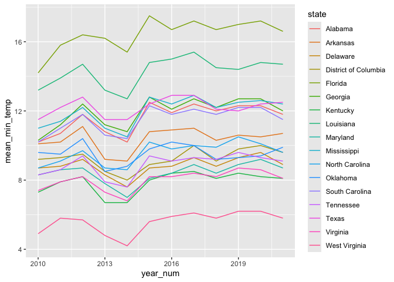
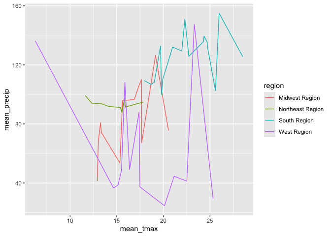
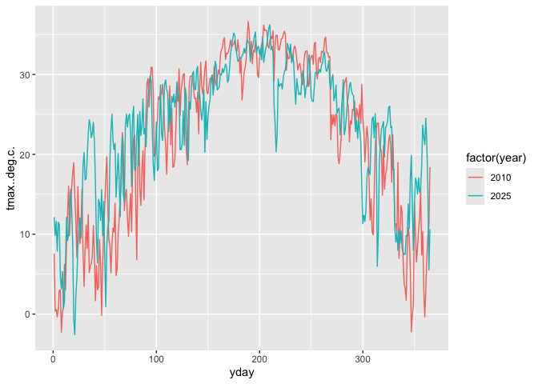

# Geog4/6300: Lab 1


## Loading data into R, data transformation, and summary statistics

**Your name: Alina Hashmi**

**Overview and lab criteria:**

This lab is intended to assess your ability to use R to load data and to
generate basic descriptive statistics. For this lab to be marked
complete, the following criteria must be met:

4.  Identify and apply appropriate data filtering and cleaning
    strategies to prepare datasets for analysis. (Task 2)
5.  Effectively interpret the code you create, explaining in plain
    language what each step does to the data. (Task 6)
6.  Identify and use appropriate external documentation — including
    package references, help files, and peer resources — to learn and
    apply unfamiliar functions or methods. (Task 7)
7.  Filter, aggregate, and transform datasets using grouping and summary
    operations to answer specific analytical questions. (Tasks 1 & 5)
8.  Reshape data between wide and long formats to meet the requirements
    of different analytical or visualization tasks. (Task 4)
9.  Create effective data visualizations across multiple chart types
    (line, scatter, histogram, Q-Q plot), applying appropriate aesthetic
    choices such as color, grouping, and labeling. (Task 3 & 5)

**Data:**

You’ll be using monthly weather data from the Daymet climate database
(http://daymet.ornl.gov) for all counties in the United States over an
12-year period (2010-2021). These data are available on the GitHub repo
for our course. The following variables are provided:

- `cty_txt`: Code for joining to census data
- `year`: Year of observation (with an initial “Y” to make it a
  character)
- `month`: Month of observation (1 = Jan, 2 = Feb, etc.)
- `median_tmax`: Median maximum recorded temperature (Celsius)
- `median_tmin`: Median minimum recorded temperature (Celsius)
- `sum_prcp`: Total recorded precipitation for the month (mm)
- `cty_name`: Name of the county
- `state`: State of the county
- `region`: Census region (map:
  https://www2.census.gov/geo/pdfs/maps-data/maps/reference/us_regdiv.pdf)
- `division`: Census division
- `X`: Longitude of the county centroid
- `Y`: Latitude of the county centroid

These labs are meant to be done collaboratively, but your final
submission should demonstrate your own original thought (don’t just copy
your classmate’s work or turn in identical assignments). Your answers to
the lab questions should be typed in this Quarto template. You’ll then
render the document to a GitHub markdown document and upload it to your
class GitHub repo.

**Procedure:**

Load the tidyverse package and import the data:

``` r
library(tidyverse)

daymet_data <- read_csv("data/daymet_monthly_median_2010-2021.csv")
```

We can look at the first few rows of the dataset using the *head()*
function. We also use *kable* to format the output as a readable table..

``` r
kable(head(daymet_data))
```

| cty_txt | year | month | median_tmax | median_tmin | sum_prcp | cty_name | state | region | division | x | y |
|:---|:---|---:|---:|---:|---:|:---|:---|:---|:---|---:|---:|
| G02060 | Y2010 | 1 | -4.27 | -10.83 | 10.04 | Bristol Bay | Alaska | West Region | Pacific Division | -156.7011 | 58.74213 |
| G02185 | Y2010 | 1 | -20.73 | -28.20 | 0.00 | North Slope | Alaska | West Region | Pacific Division | -153.4411 | 69.30696 |
| G02180 | Y2010 | 1 | -16.50 | -23.72 | 5.75 | Nome | Alaska | West Region | Pacific Division | -163.9703 | 64.89492 |
| G02050 | Y2010 | 1 | -11.20 | -18.90 | 24.55 | Bethel | Alaska | West Region | Pacific Division | -159.7678 | 60.92187 |
| G02261 | Y2010 | 1 | -13.93 | -20.03 | 15.84 | Valdez-Cordova | Alaska | West Region | Pacific Division | -144.4573 | 61.57080 |
| G02170 | Y2010 | 1 | -5.10 | -12.42 | 35.84 | Matanuska-Susitna | Alaska | West Region | Pacific Division | -149.5702 | 62.31653 |

There are a lot of observations here, 452,448 to be exact. To get a
better grasp on the data, we can use `group_by()` and `summarise()` from
the tidyverse package. This will allow us to identify the mean value for
each year by county across the study period.

## Task 1

*Use `group_by()` and `summarise()` to calculate the mean minimum
temperature for each year by county across all months, also including
State and Region as grouping variables. Your resulting dataset should
show the value of tmin for each county in each year. Use the `kable()`
and `head()` functions as shown above to call the resulting table.*

``` r
mean_min_temp_data <- daymet_data %>%
  group_by(year, region, state, cty_name) %>%
  summarize(mean_tmin = mean(median_tmin))
```

    `summarise()` has regrouped the output.
    ℹ Summaries were computed grouped by year, region, state, and cty_name.
    ℹ Output is grouped by year, region, and state.
    ℹ Use `summarise(.groups = "drop_last")` to silence this message.
    ℹ Use `summarise(.by = c(year, region, state, cty_name))` for per-operation
      grouping (`?dplyr::dplyr_by`) instead.

``` r
kable(head(mean_min_temp_data))
```

| year  | region         | state    | cty_name  | mean_tmin |
|:------|:---------------|:---------|:----------|----------:|
| Y2010 | Midwest Region | Illinois | Adams     |  6.124583 |
| Y2010 | Midwest Region | Illinois | Alexander |  9.034167 |
| Y2010 | Midwest Region | Illinois | Bond      |  6.966250 |
| Y2010 | Midwest Region | Illinois | Boone     |  3.865834 |
| Y2010 | Midwest Region | Illinois | Brown     |  5.805000 |
| Y2010 | Midwest Region | Illinois | Bureau    |  4.705417 |

## Task 2

*Let’s shift to the state level, focusing on those in the South Region.
Filter the original data frame (`daymet_data`) to just include counties
in this region. Then calculate the mean minimum temperature by year for
each state. For an optional extra challenge, use the `round()` function
to include only 1 decimal point. Use `kable()` and `head()` to call the
first few lines of the resulting table.*

``` r
filtered_south_data <- filter(daymet_data, region == "South Region")
filtered_south_data <- filtered_south_data %>%
  group_by(year, state) %>%
  summarise(mean_min_temp = round((mean(median_tmin)), digits = 1))
```

    `summarise()` has regrouped the output.
    ℹ Summaries were computed grouped by year and state.
    ℹ Output is grouped by year.
    ℹ Use `summarise(.groups = "drop_last")` to silence this message.
    ℹ Use `summarise(.by = c(year, state))` for per-operation grouping
      (`?dplyr::dplyr_by`) instead.

``` r
kable(head(filtered_south_data))
```

| year  | state                | mean_min_temp |
|:------|:---------------------|--------------:|
| Y2010 | Alabama              |          10.2 |
| Y2010 | Arkansas             |          10.1 |
| Y2010 | Delaware             |           8.7 |
| Y2010 | District of Columbia |           9.2 |
| Y2010 | Florida              |          14.2 |
| Y2010 | Georgia              |          10.3 |

## Task 3

*To visualize the trends, we could use ggplot to visualize change in
mean temperature over time. Create a line plot (`geom_line`) showing the
state means you calculated in task 2. Use the `color` parameter to show
separate colors for each state. You may also need to define the state as
a group in the aesthetic parameter.*

``` r
filtered_south_year <- filtered_south_data %>%
  mutate(year_num = parse_number(year))

ggplot(filtered_south_year, aes(x = year_num, y = mean_min_temp)) +
  geom_line(aes(color = state))
```



## Task 4

*If you wanted to look at these data as a table, you’d need to have it
in wide format. Use the `pivot_wider()` function to create a wide-format
version of the data frame you created in task 2. In this case, the rows
should be states, the columns should be the years, and the data in those
columns should be mean minimum temperatures. Then call the whole table
using `kable()`.*

``` r
filtered_south_wide <- filtered_south_data %>%
  pivot_wider(
    names_from = year,
    values_from = mean_min_temp
  )

kable(head(filtered_south_wide))
```

| state | Y2010 | Y2011 | Y2012 | Y2013 | Y2014 | Y2015 | Y2016 | Y2017 | Y2018 | Y2019 | Y2020 | Y2021 |
|:---|---:|---:|---:|---:|---:|---:|---:|---:|---:|---:|---:|---:|
| Alabama | 10.2 | 10.7 | 11.8 | 10.8 | 10.2 | 12.5 | 11.9 | 12.4 | 12.0 | 12.3 | 12.3 | 11.8 |
| Arkansas | 10.1 | 10.2 | 11.1 | 9.2 | 9.1 | 10.8 | 10.9 | 11.0 | 10.3 | 10.6 | 10.5 | 10.7 |
| Delaware | 8.7 | 8.8 | 9.2 | 8.3 | 7.6 | 8.7 | 8.8 | 9.3 | 8.8 | 9.3 | 9.6 | 8.9 |
| District of Columbia | 9.2 | 9.3 | 9.5 | 8.5 | 8.0 | 8.9 | 9.1 | 10.0 | 9.1 | 9.8 | 10.0 | 9.6 |
| Florida | 14.2 | 15.8 | 16.4 | 16.2 | 15.4 | 17.5 | 16.7 | 17.2 | 16.7 | 17.0 | 17.2 | 16.6 |
| Georgia | 10.3 | 11.2 | 12.4 | 11.2 | 10.8 | 12.8 | 12.1 | 12.7 | 12.2 | 12.7 | 12.7 | 12.0 |

## Task 5

*Let’s assess the relationship of heat and precipitation by region.
Returning to the original dataset, create a data frame that shows the
mean maximum temperature and mean precipitation for all states in 2015,
also including region as a subgroup in your `group_by`. Then use ggplot
to create a scatterplot (`geom_point`) for these two variables, coloring
the points using the region variable.*

``` r
mean_max_temp_precip <- daymet_data %>%
  filter(year == "Y2015") %>%
  group_by(region, state) %>%
  summarize(mean_tmax = mean(median_tmax), mean_precip = mean(sum_prcp))
```

    `summarise()` has regrouped the output.
    ℹ Summaries were computed grouped by region and state.
    ℹ Output is grouped by region.
    ℹ Use `summarise(.groups = "drop_last")` to silence this message.
    ℹ Use `summarise(.by = c(region, state))` for per-operation grouping
      (`?dplyr::dplyr_by`) instead.

``` r
ggplot(mean_max_temp_precip, aes(x = mean_tmax, y = mean_precip)) +
  geom_line(aes(color = region))
```



## Task 6

*In the space below, explain what each function in your code for task 5
does to the dataset in plain English.*

The filter() function sorts the table to only include data from 2015.
The group_by() function then sorts the data first by region then by the
states in that specific region. The summarize() function adds the
columns median_tmax, which calculates the mean max temperature for the
state in 2015, and mean_precip, which calculates the mean precipitation
for the state in 2015. Finally, ggplot is used to graph both variables
from the cleaned up data.

## Task 7

*The `dplyr` package also includes `across` function. Use `?across` on
the R command line to open the documentation for this function. In the
space below, explain what it does in your own words. Then interpret the
way the across function is used below, going line by line within the
function.*

``` r
state_2015 <- daymet_data %>%
  filter(year == "Y2015") %>%
  group_by(region, state) %>%
  summarise(
    across(
      c(median_tmax, sum_prcp),
      mean,
      na.rm = TRUE,
      .names = "mean_{.col}"
    )
  )
```

    Warning: There was 1 warning in `summarise()`.
    ℹ In argument: `across(c(median_tmax, sum_prcp), mean, na.rm = TRUE, .names =
      "mean_{.col}")`.
    ℹ In group 1: `region = "Midwest Region"`, `state = "Illinois"`.
    Caused by warning:
    ! The `...` argument of `across()` is deprecated as of dplyr 1.1.0.
    Supply arguments directly to `.fns` through an anonymous function instead.

      # Previously
      across(a:b, mean, na.rm = TRUE)

      # Now
      across(a:b, \(x) mean(x, na.rm = TRUE))

    `summarise()` has regrouped the output.
    ℹ Summaries were computed grouped by region and state.
    ℹ Output is grouped by region.
    ℹ Use `summarise(.groups = "drop_last")` to silence this message.
    ℹ Use `summarise(.by = c(region, state))` for per-operation grouping
      (`?dplyr::dplyr_by`) instead.

According to ?across, the function across() allows you to apply the same
function to more than one column at a time. This greatly reduces
repetitive code. In this case, across() is used to calculate the mean of
the columns “median_tmax” and “sum_prcp” at the same time.

## Challenge Question

In class, we covered ways of working with the Daymet API. Create a
script below that uses the **daymetr** package to download data from
Daymet for a place (or places) of your choosing. Then visualize the
temporal pattern for a variable of your choosing in this place, similar
to what you did in question 4. Use a dplyr function (`mutate()`,
`summarise()`, `filter()`, etc.) to do any needed data wrangling and
create a visual using ggplot.

In addition to this code, write a short summary of a pattern that’s
evident in the data you visualized.

``` r
library(daymetr)

eastcobb_daymet<-download_daymet(site="east cobb",lat=33.978132718,lon=-84.453119107,start=2010,end=2025,internal=TRUE)
```

    Downloading DAYMET data for: east cobb at 33.978132718/-84.453119107 latitude/longitude !

    Done !

``` r
eastcobb_data<-eastcobb_daymet$data

eastcobb_data_2010_2025 <- eastcobb_data %>%
  filter(year == "2010" | year == "2025") %>%
  select(year, yday, tmax..deg.c.)

ggplot(eastcobb_data_2010_2025, aes(x = yday, y = tmax..deg.c., color = factor(year))) +
  geom_line()
```



I downloaded daymet data for East Cobb, GA between 2010 and 2025 to see
if temperatures have risen substantially as a result of climate change.
During the winter months, temperatures were much higher in 2025 than
they were in 2010; however, I was shocked to see that the temperatures
were similar, or even lower in 2025, during the summer months.

## Final Submission Stuff

### Disclosure of Assistance

Besides class materials, what other sources of assistance did you use
while completing this lab? These can include input from classmates,
relevant material identified through web searches (e.g., Stack
Overflow), or assistance from ChatGPT or other AI tools. How did these
sources support your own learning in completing this lab?

I used AI Overview to understand the function round() and why it was not
working with the dataframe. I also used AI overview to help me in the
challenge question when displaying the two years as distinct lines of
data.

### Lab Reflection

How do you feel about the work you did on this lab? Was it easy,
moderate, or hard? What are the biggest things you learned by completing
it?

I feel good about the work I did on this lab! I found it a little
challenging when having to sort the data and using ggplot to graph the
data.
